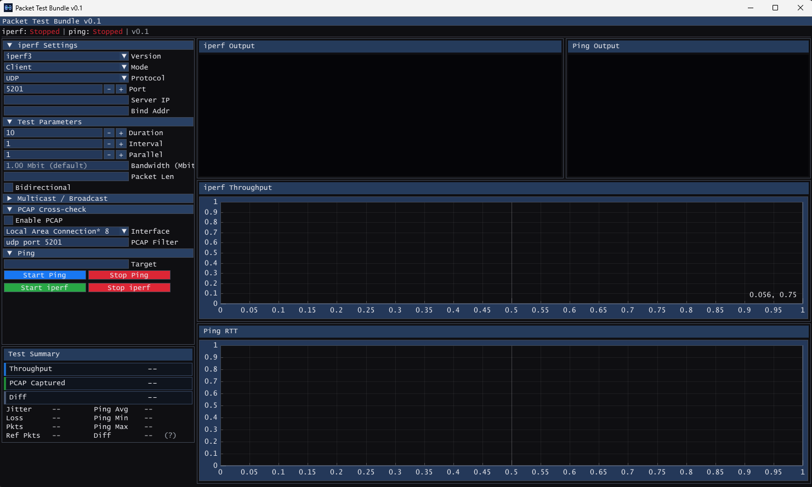

# Packet Test Bundle — Windows GUI for iperf2, iperf3 & tshark

A free, open-source Windows GUI for network bandwidth and latency testing. Bundles **iperf2**, **iperf3**, **tshark**, and **ping** into a single portable application — no command line required. Measure TCP/UDP throughput between two machines, capture packets with BPF filters, and watch live latency charts, all from one dark-themed native interface.


## Screenshot



## Use Cases

- **LAN / WAN speed test** — measure real TCP or UDP throughput between two Windows machines
- **Network troubleshooting** — capture live packets with tshark and BPF filters without opening a terminal
- **Latency monitoring** — run a continuous ping and watch the latency graph spike in real time
- **iperf3 GUI** — a graphical front-end for iperf3 on Windows with client and server modes

## Features

- **iperf2 / iperf3** — TCP/UDP throughput testing, client and server modes, configurable duration and parallel streams
- **Ping** — continuous latency monitoring with a live scrolling chart
- **Packet capture** — tshark-based network capture with BPF filter support, no Wireshark install needed
- **Live charts** — ImPlot-based throughput and latency graphs that update in real time
- **Dark theme** — native Win32 + ImGui/DirectX 11 rendering
- **DPI-aware** — scales correctly on all display resolutions including HiDPI / 4K monitors
- **Portable** — single `.exe`, no installation required (packet capture needs Npcap)

## Installation

Download the latest release from the [Releases page](https://github.com/galenthas/packet-test-bundle/releases):

- **`PacketTestBundle_vX.X.X_Setup.exe`** — Windows installer (includes Npcap for packet capture)
- **`PacketTestBundle.exe`** — Portable executable

> **Note:** Packet capture (tshark) requires [Npcap](https://npcap.com). The installer handles this automatically.

## How It Works

Packet Test Bundle launches bundled copies of iperf2, iperf3, tshark, and ping as child processes, parses their output in real time, and renders the results as interactive ImPlot charts inside a DirectX 11 window. Each tool runs on its own worker thread so the GUI stays responsive during long tests. No network traffic is sent to any external server — all tests run point-to-point between machines you control.

## FAQ

### Is Packet Test Bundle free?

Yes. Packet Test Bundle is free and open source under the MIT license. You can use it for personal, educational, and commercial purposes.

### How do I test network speed between two computers?

1. Download Packet Test Bundle on both machines.
2. On one machine, start an **iperf3 server**.
3. On the other machine, enter the server's IP address and click **Start** in client mode.
4. The live chart will show your TCP or UDP throughput in real time.

### Do I need to install Wireshark for packet capture?

No. Packet Test Bundle ships with tshark (the Wireshark command-line engine) already bundled. You only need to install [Npcap](https://npcap.com) for the capture driver — the Windows installer does this automatically.

### What is the difference between iperf2 and iperf3?

iperf2 supports multi-threaded parallel streams and bidirectional tests natively. iperf3 is a rewrite with JSON output, single-threaded by design, and more detailed per-stream statistics. Packet Test Bundle includes both so you can pick the right tool for each test.

### Does it work on Windows 10 and Windows 11?

Yes. Packet Test Bundle is tested on Windows 10 and Windows 11. It is DPI-aware and scales correctly on standard and HiDPI / 4K displays.

## Alternatives

| Tool | GUI | iperf | Packet Capture | Open Source |
|---|---|---|---|---|
| **Packet Test Bundle** | Yes (native) | iperf2 + iperf3 | Yes (tshark) | MIT |
| jperf / JPerf | Java Swing | iperf2 only | No | GPL |
| iPerf3 CLI | No | iperf3 only | No | BSD |
| Wireshark | Yes | No | Yes | GPL |
| LAN Speed Test | Yes | No | No | No (paid) |

Packet Test Bundle combines iperf throughput testing and tshark packet capture in a single lightweight native app — no Java runtime, no browser, no separate Wireshark install.

## Build

Requires Visual Studio 2022 Build Tools and CMake.

```cmd
cmake -S packettestbundle -B packettestbundle\build -G Ninja -DCMAKE_BUILD_TYPE=Release
cmake --build packettestbundle\build
```

ImGui and ImPlot are fetched automatically via CMake FetchContent.

### Run tests

```cmd
cmake -S packettestbundle -B packettestbundle\build_test -DBUILD_TESTING=ON
cmake --build packettestbundle\build_test --target run_tests
```

### Build installer

Requires [Inno Setup 6](https://jrsoftware.org/isinfo.php).

```cmd
ISCC /DMyAppVersion=0.1.0 packettestbundle\installer.iss
```

## Project Structure

| File | Description |
|---|---|
| `src/app.cpp/.h` | Main application, ImGui/DX11 render loop |
| `src/app_meta.h` | App name and version string |
| `src/version.h` | Single-source version definition |
| `src/worker_iperf.cpp/.h` | iperf2/iperf3 worker thread |
| `src/worker_ping.cpp/.h` | Ping worker thread |
| `src/worker_pcap.cpp/.h` | tshark/dumpcap capture worker |
| `src/command_builder.cpp/.h` | iperf command line builder |
| `src/parser_iperf.cpp/.h` | iperf output parser |
| `src/process_util.cpp/.h` | Child process launch and I/O |
| `installer.iss` | Inno Setup installer script |

## Versioning

Version is defined in `src/version.h`. To release a new version, update the defines and tag:

```c
#define VERSION_MAJOR 0
#define VERSION_MINOR 1
#define VERSION_PATCH 1
```

```bash
git tag v0.1.1 && git push origin v0.1.1
```

CI will automatically build the installer and portable `.exe` and attach both to the GitHub Release.

## Dependencies

| Tool | Bundled | License |
|---|---|---|
| iperf2 | Yes | BSD |
| iperf3 | Yes | BSD |
| tshark | Yes | GPLv2 |
| Npcap | Installer only | Npcap License |
| Dear ImGui | FetchContent | MIT |
| ImPlot | FetchContent | MIT |
